:::tip
一些网站：acwing，洛谷，牛客，leetcode
:::

# 工作leetcode代码部分

75 【Java后端开发｜过来人分享实习秋招经验啦 - 冰麒麟西瓜（计算机求职版） | 小红书 - 你的生活指南】 😆 IQy1mCLxjN6cP2d 😆 [https://www.xiaohongshu.com/discovery/item/65ed92e1000000000d00cb1a?source=webshare&amp;xhsshare=pc_web&amp;xsec_token=ABclFw6-i5ePuLZKa7wDmowBuk236QDf6Qwy7SLGiMDnA=&amp;xsec_source=pc_share](https://www.xiaohongshu.com/discovery/item/65ed92e1000000000d00cb1a?source=webshare&xhsshare=pc_web&xsec_token=ABclFw6-i5ePuLZKa7wDmowBuk236QDf6Qwy7SLGiMDnA=&xsec_source=pc_share)

# 暴力求解

## 枚举

### KY266 反序数

KY266 反序数

[https://www.nowcoder.com/share/jump/5838130341742178780683](https://www.nowcoder.com/share/jump/5838130341742178780683)

```c++
#include<iostream>
using namespace std;
//1.函数在main之前
//2.console动不了就开始调试，发现错误
int verse(int n) {
    int remain;
    int reverse = 0;
    while (n != 0) {
        remain = n % 10;
        n /= 10;
        reverse = reverse * 10 + remain;
    }
    return reverse;
}
int main() {
    for (int i = 1000; i <= 9999; i++) {
        if (i * 9 == verse(i)) {
            printf("%d\n", i);
        }
    }
    return 0;
}

```

### KY267 对称平方数1

KY267 对称平方数1

[https://www.nowcoder.com/share/jump/5838130341742179833042](https://www.nowcoder.com/share/jump/5838130341742179833042)

```c++
#include<iostream>
using namespace std;
//1.反序数=数本身就是具有对称性质的数
//2.答案出不来就带一个例子进去仔细分析，在devc++中
int reverse(int n) {
    int remain;
    int sum = 0;
    while (n != 0) {
        remain = n % 10;
        n /= 10;
        sum = sum * 10 + remain;
    }
    return sum;
}

int main() {
    for (int i = 0; i <= 256; i++) {
        if (i*i == reverse(i*i)) {
            printf("%d\n", i);
        }
    }
    return 0;
}
```

### KY50 与7无关的数

KY50 与7无关的数

[https://www.nowcoder.com/share/jump/5838130341742180403232](https://www.nowcoder.com/share/jump/5838130341742180403232)

```c++
#include<iostream>
using namespace std;
//看懂题目很重要
bool unrelated(int n) {
    if (n % 7 == 0) {
        return false;
    }
    while (n != 0) {
        int remain = n % 10;
        if (remain == 7) {
            return false;
        }
        n /= 10;
    }
    return true;
}
int main() {
    int n;
    scanf("%d", &n);
    int sum = 0;
    for (int i = 0; i <= n; i++) {
        if (unrelated(i)) {
            sum = sum + i * i;
        }
    }
    printf("%d", sum);
    return 0;
}

```

‍

‍

### KY155 百鸡问

KY155 百鸡问题

[https://www.nowcoder.com/share/jump/5838130341742203089698](https://www.nowcoder.com/share/jump/5838130341742203089698)

```c++
#include<iostream>
#include<cstdio>
using namespace std;
int main() {
    int n;
    scanf("%d", &n);
    for (int x = 0; x <= 100; ++x) {
        for (int y = 0; y <= 100; ++y) {
            for (int z = 0; z <= 100; ++z) {
                if (5 * x + 3 * y + (1.0 / 3)*z <= n && x + y + z == 100)
                    printf("x=%d,y=%d,z=%d\n", x, y, z);
            }
        }
    }
}

```

‍

## 模拟

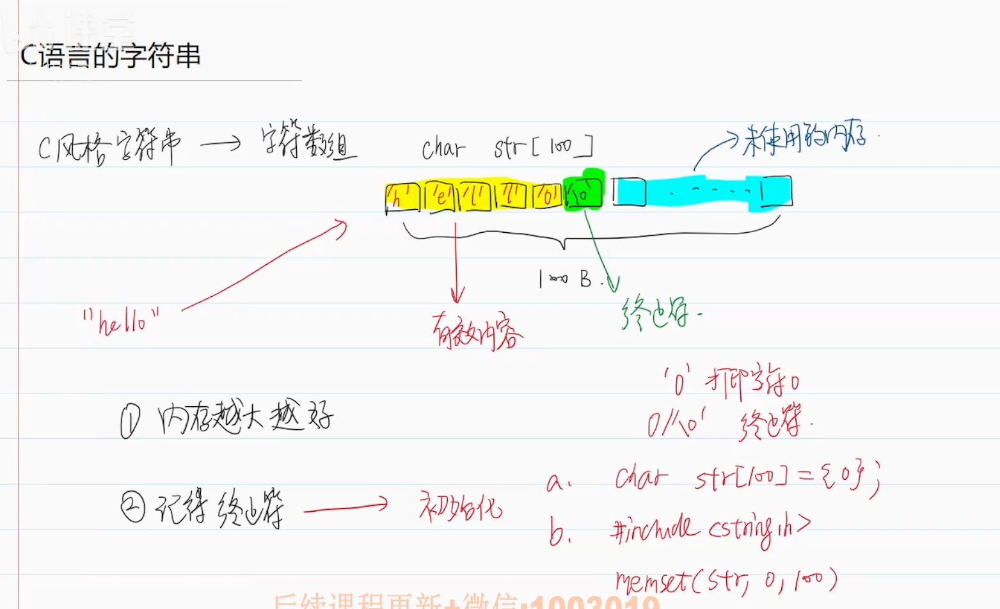​

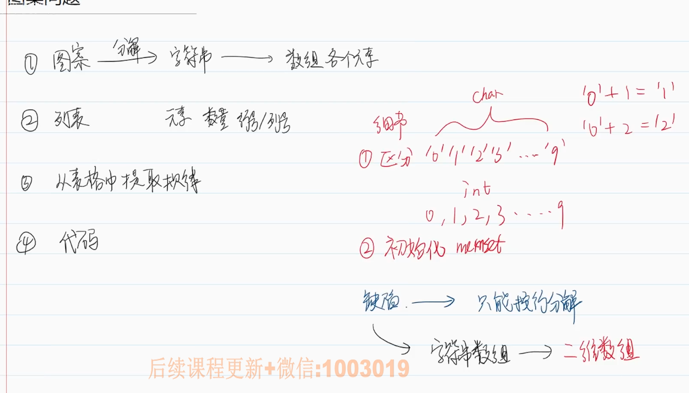​

### AcWing 3663. 打印数字菱形

[https://www.acwing.com/solution/content/52892/](https://www.acwing.com/solution/content/52892/)

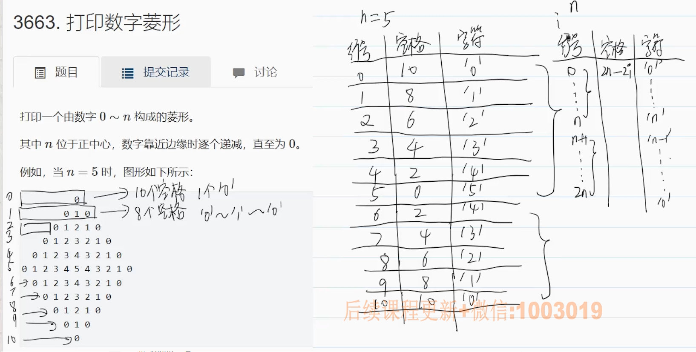​

```c++
#include<iostream>
using namespace std;
int main(){
    char arr[100][100]={0};
    int n;
    scanf("%d",&n);
    for(int i=0;i<=n;++i){
        int j;
        for(j=0;j<2*n-2*i;++j){
            arr[i][j]=' ';
        }
        for(int k=0;k<=i;++k){
            arr[i][j]='0'+k;
            arr[i][j+1]=' ';
            j+=2;
        }
        for(int k=i-1;k>=0;--k){
            arr[i][j]='0'+k;
            arr[i][j+1]=' ';
            j+=2;
        }
    }
//    for(int i=0;i<=n;++i){
//        printf("%s\n",arr[i]);
//    }
    for(int i=n+1;i<=2*n;++i){
        int j;
        for(j=0;j<2*i-2*n;++j){
            arr[i][j]=' ';
        }
        for(int k=0;k<=2*n-i;++k){
            arr[i][j]='0'+k;
            arr[i][j+1]=' ';
            j+=2;
        }
        for(int k=2*n-i-1;k>=0;--k){
            arr[i][j]='0'+k;
            arr[i][j+1]=' ';
            j+=2;
        }
    }
    for(int i=0;i<=2*n;++i){
        printf("%s\n",arr[i]);
    }
}
```

# 字符串

### 基本概念

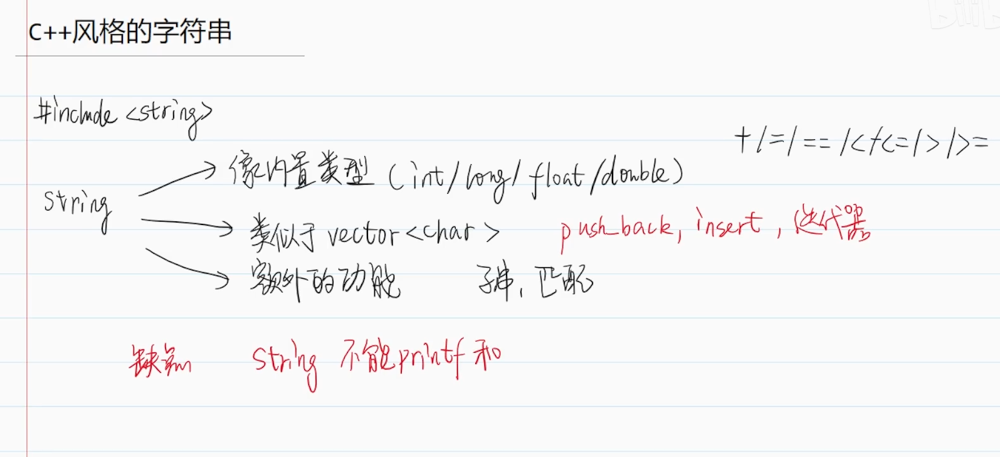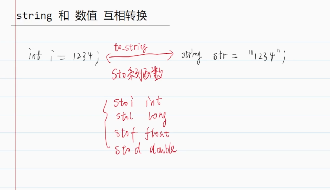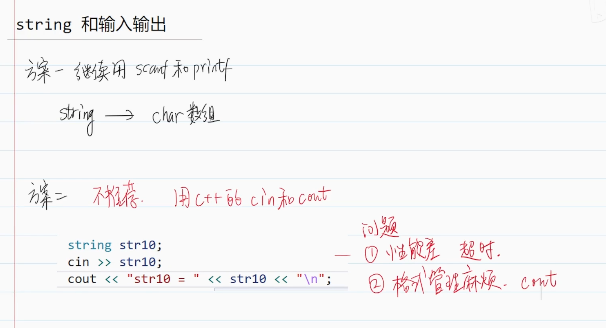​

```c++
#include <map>
#include <iostream>
#include <cstring>
using namespace std;
int main(){
    string str="abcdefg";
    char ch;
    ch=str[1];
    //类似vecotr
    str.push_back('h');
    str.pop_back();
    string::iterator it;
    for(it=str.begin();it!=str.end();++it){
        printf("*it=%c\n",*it);
    }
    //比vector强a
    str.insert(0,"xyz");
    str.erase(0,3);//[0,3)
    //子串
    string str1=str.substr(0,3);//[0,3)
    int pos=str.find("ce",0);//从下表0开始找
    //string和数值之间的转变
    int i=1234;
    string  str2=to_string(i);
    float f=12.34;
    str2= to_string(f);
    int i2= stoi(str2);
    //string的输入输出
    char arr[100];
    scanf("%s",arr);
    string str3=arr;
    printf("str3=%s\n",str3.c_str());
    string str4;
    cin>>str4;
    cout<<"str4="<<str4<<endl;

}
```

### 单词个数统计

输入一整行：fgets(arr,200,stdin);//stdin-标准输入

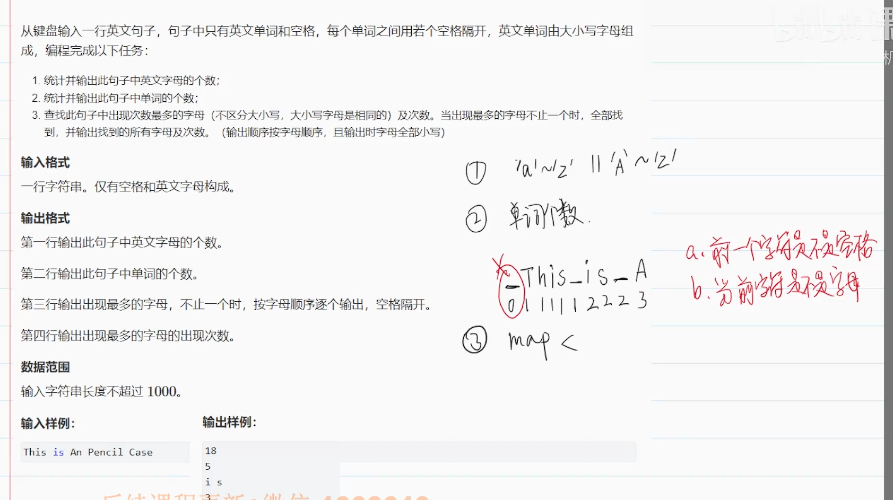

‍

```c++
#include<iostream>
#include<map>
using namespace std;
int main(){
    char arr[200]={0};
    fgets(arr,200,stdin);
    int i=0;
    int alphaCount=0;
    int wordCount=0;
    bool flag=true;//上一个单词末是空格
    map<char,int> map1;

    while(1){
        if(arr[i]=='\n' || arr[i]=='\0'){
            break;
        }else if(arr[i]==' '){
            flag=true;
        }else{
            alphaCount++;
            if(arr[i]>='A'&&arr[i]<='Z'){
                arr[i]+=32;
            }
            map1[arr[i]]++;
            if(flag){
                wordCount++;
            }
            flag= false;
        }
        ++i;
    }
    int maxCount=0;
    map<char,int>::iterator it;
    for(it=map1.begin();it!=map1.end();++it){
        if(maxCount<it->second){
            maxCount=it->second;
        }
    }
    printf("%d\n",alphaCount);
    printf("%d\n", wordCount);
    for(it=map1.begin();it!=map1.end();++it){
        if(maxCount==it->second){
           printf("%c %d\n",it->first,maxCount);
        }
    }
    printf("%d\n",maxCount);

}
```

# stl

## vector-动态数组

### 基本概念

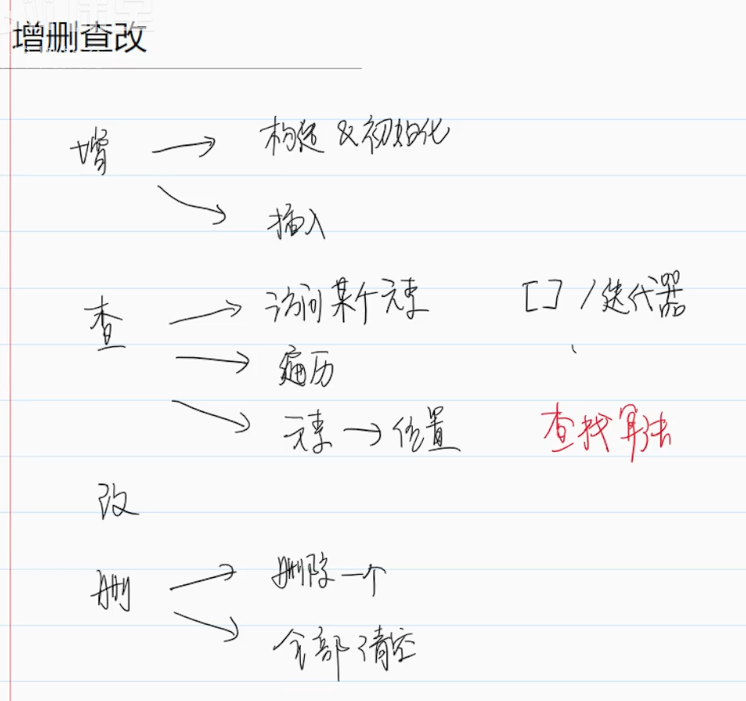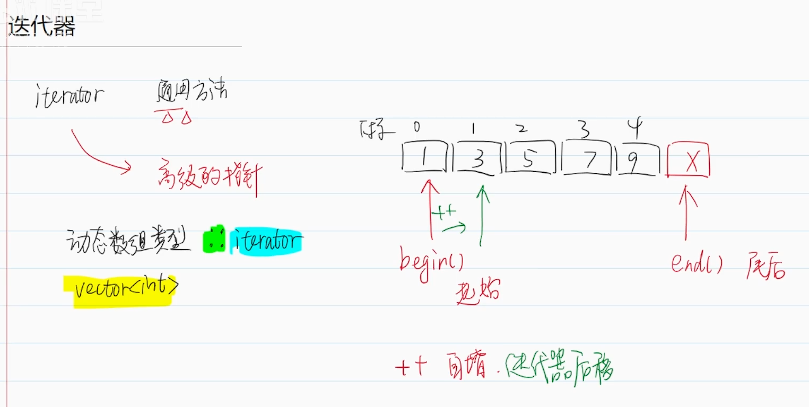​

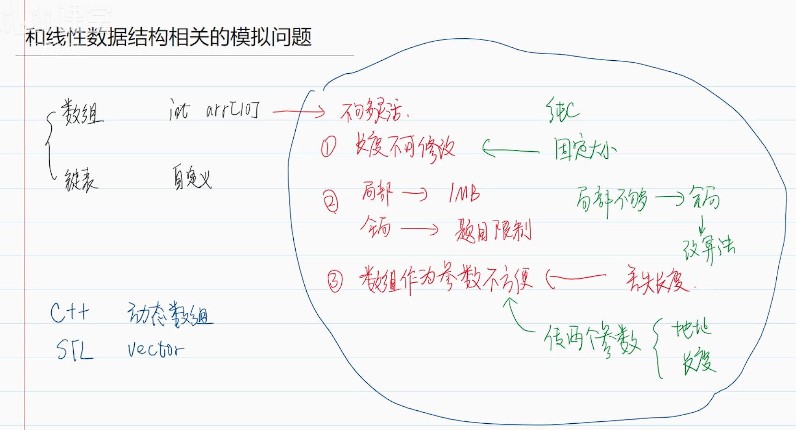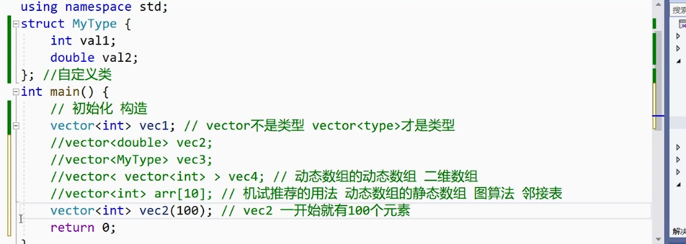​

```c++
#include<iostream>
#include<vector>
using namespace std;
int main(){
    vector<int> vec1={1,2,3,4,5};
//    int n;
//    while(scanf("%d",&n)!=EOF){
//        vec1.push_back(n);
//    }
    printf("vec[3]=%d\n",vec1[3]);
    for(int i=0;i<vec1.size();i++){
        printf("%d ",vec1[i]);
    }
    printf("\n");
    vector<int>::iterator it;
    for(it=vec1.begin();it!=vec1.end();it++){
        printf("*it=%d\n",*it);
    }
    it=vec1.begin();
    vec1.insert(it,2);
//    inserts会修改动态数组的结构，插入完成以后it的指向无意义
    it=vec1.begin();
    it=it+3;//it+3相当于3次++只能在vectori中使用
    vec1.insert(it,2);
//    vec1.clear();
    vec1.pop_back();
    it=vec1.begin()+2;
    vec1.erase(it);


}
```

### KY20 完数VS盈数

[https://www.nowcoder.com/share/jump/5838130341742518967193](https://www.nowcoder.com/share/jump/5838130341742518967193)

```c++
#include<iostream>
#include<vector>
using namespace std;
int FactorSum(int n) {
    int sum = 0;
    for (int i = 1; i < n; i++) {
        if (n % i == 0) {
            sum += i;
        }
    }
    return sum;
}
int main() {
    vector<int> EVec;
    vector<int> Gvec;
    printf("E: ");
    for (int i = 2; i <= 60; ++i) {
        if (i == FactorSum(i)) {
            EVec.push_back(i);
        } else if (i < FactorSum(i)) {
            Gvec.push_back(i);
        }
    }
    vector<int>::iterator it;
    for (it = EVec.begin(); it != EVec.end(); ++it) {
        printf("%d ", *it);
    }
    printf("\n");
    printf("G: ");
    for (it = Gvec.begin(); it != Gvec.end(); ++it) {
        printf("%d ", *it);
    }
}

```

## list-双向链表【几乎和vector一样】

### 基本概念

```c++
#include<iostream>
#include<list>
using namespace std;
int main(){
    list<int> list1={1,3,5,7,9};
    list<int>::iterator it=list1.begin();
    ++it;
    ++it;
    list1.erase(it);
    for(it=list1.begin();it!=list1.end();++it){
        printf("%d\n",*it);
    }

}

```

## set-集合

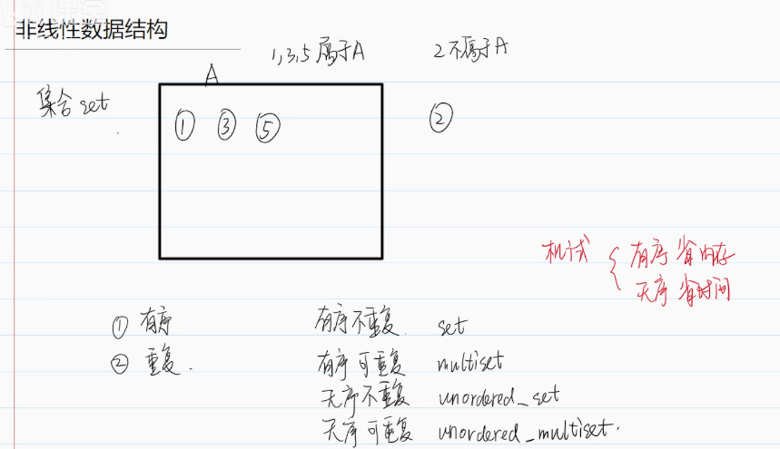https://www.nowcoder.com/discuss/723193949468229632

### 基础知识

```c++
#include<iostream>
#include<set>
using namespace std;
int main(){
    set<int> set1={1,2,3,4,5};
    set1.insert(6);
    set1.erase(2);
    set<int>::iterator it;
    for(it=set1.begin();it!=set1.end();++it){
        printf("%d ",*it);
    }
    printf("\n");
    if(set1.find(7)==set1.end()){
        printf("找不到\n");
    }else{
//        set1.find(7)返回迭代器
        printf("%找到了");
    }

    printf("2 occurs %d times\n",set1.count(2));
}

```

### 3481.阶乘的和

[https://www.nowcoder.com/discuss/723193949468229632](https://www.nowcoder.com/discuss/723193949468229632)

## map

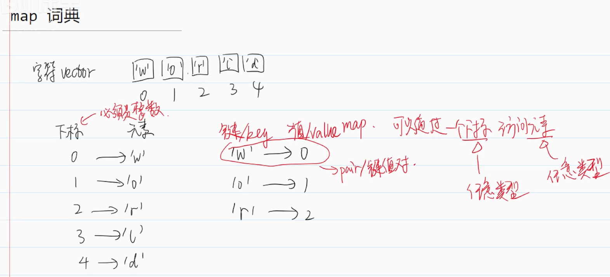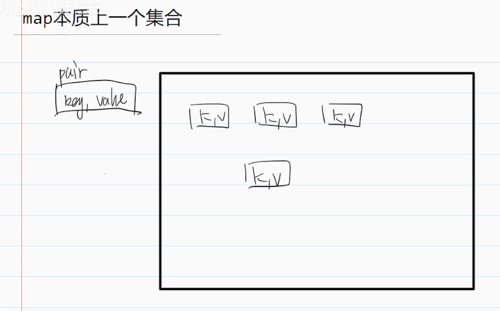​

### 基础知识

```c++
#include<iostream>
#include<map>
using namespace std;
int main(){
    map<char,int> map1={{'c',3},{'d',4},{'e',5}};
    pair<char,int> pair1={'a',1};
    printf("key=%c,value=%d\n",pair1.first,pair1.second);
    map1.insert(pair1);
    map1.insert({'b',2});
    map<char,int>::iterator it;
    for(it=map1.begin();it!=map1.end();++it){
        printf("key=%c,value=%d\n",it->first,it->second);
    }
    printf("value=%d\n",map1['y']);//key=y,value=0
    for(it=map1.begin();it!=map1.end();++it){
        printf("key=%c,value=%d\n",it->first,it->second);
    }
    if(map1.find('y')==map1.end()){
        printf("key is not in map\n");
    }else{
        printf("value=%d\n",map1['y']);
    }
}

```

### KY6 手机键盘

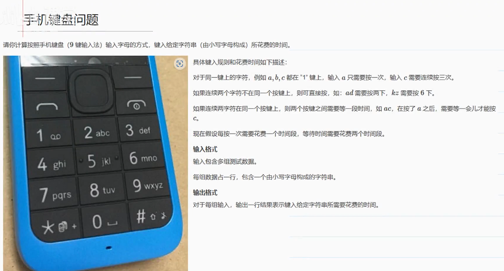​

```c++
#include <map>
#include <iostream>
#include <cstdio>
#include <cstring>
using namespace std;
int main()
{
    map<char,int> inputTime = {     //字母按几次
            {'a',1},{'b',2},{'c',3},
            {'d',1},{'e',2},{'f',3},
            {'g',1},{'h',2},{'i',3},
            {'j',1},{'k',2},{'l',3},
            {'m',1},{'n',2},{'o',3},
            {'p',1},{'q',2},{'r',3},{'s',4},
            {'t',1},{'u',2},{'v',3},
            {'w',1},{'x',2},{'y',3},{'z',4}
    };
    map<char,int> keyMap = {        //字母在哪个按键上
            {'a',2},{'b',2},{'c',2},
            {'d',3},{'e',3},{'f',3},
            {'g',4},{'h',4},{'i',4},
            {'j',5},{'k',5},{'l',5},
            {'m',6},{'n',6},{'o',6},
            {'p',7},{'q',7},{'r',7},{'s',7},
            {'t',8},{'u',8},{'v',8},
            {'w',9},{'x',9},{'y',9},{'z',9}
    };
    string str;
    while (cin>>str)
    {
        int lastinput=1;                //记录上次的按键
        int time=0;
        for (int i = 0; i < str.size(); i++)//遍历字符串
        {
            //判断是否要等待
            if (lastinput==keyMap[str[i]])
            {
                time+=2;//等待2s
            }
            time+=inputTime[str[i]];//输入一个字母用时
            lastinput=keyMap[str[i]];//记录按键
        }
        cout<<time<<endl;
    }
    return 0;
} 

```

```c++
#include<iostream>
#include<map>
using namespace std;
int main(){
    map<char,int> map1={{'c',3},{'d',4},{'e',5}};
    pair<char,int> pair1={'a',1};
    printf("key=%c,value=%d\n",pair1.first,pair1.second);
    map1.insert(pair1);
    map1.insert({'b',2});
    map<char,int>::iterator it;
    for(it=map1.begin();it!=map1.end();++it){
        printf("key=%c,value=%d\n",it->first,it->second);
    }
    printf("value=%d\n",map1['y']);//key=y,value=0
    for(it=map1.begin();it!=map1.end();++it){
        printf("key=%c,value=%d\n",it->first,it->second);
    }
    if(map1.find('y')==map1.end()){
        printf("key is not in map\n");
    }else{
        printf("value=%d\n",map1['y']);
    }
}

```

## 队列-公平

### 基本概念

empty(),size(),pop(),push(i),front()-出队口,back()-进队口

```c++
#include<iostream>
#include<queue>
using namespace std;
int main(){
    queue<int> Q;
    printf("%d",Q.empty());
    for(int i=0;i<10;++i){
        Q.push(i);
        printf("%d-%d\n",Q.front(),Q.back());
    }
    printf("%d\n",Q.size());
    printf("-------");
    for(int i=0;i<9;++i){
        Q.pop();
        printf("%d-%d\n",Q.front(),Q.back());
    }
    return 0;
}
```

### 约瑟夫环

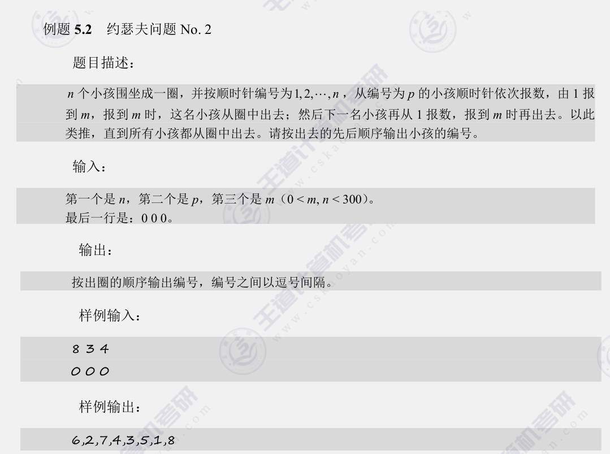​

```c++
#include<iostream>
#include<queue>
using namespace std;
int main(){
    queue<int> myQueue;
    int n,p,m;//n-孩子数，p-开始报数的编号，m-几个开始淘汰
    while(1){
        scanf("%d%d%d",&n,&p,&m);
        if(n==0&&p==0&&m==0){
            break;
        }
        //1.构建初始对内，从p开始
        int no=p;
        for(int i=0;i<n;i++){
            myQueue.push(no);
            no++;
            if(no>n){
                no=1;
            }
        }
        //2.开始报数,报数的序号
        int say=1;
        while(1){
            int front=myQueue.front();
            myQueue.pop(); //出栈
            if(say==m){
                say=1;
                if(myQueue.empty()){
                    printf("%d\n",front);
                    break; //出栈打印，到空了就结束
                }else{
                    printf("%d,",front);  //出栈不到空打印
                }
            }else{
                myQueue.push(front); //出栈后入栈
                ++say;

            }
        }
    }
}
```

‍

## 栈-特权

### 基本概念

empty(),size(),pop(),push(i),top(出栈口)

```c++
#include<iostream>
#include<stack>
using namespace std;
int main(){
   stack<int> myStack;
   printf("%d",myStack.empty());
   for(int i=0;i<10;i++){
       myStack.push(i);
       printf("top %d\n",myStack.top());
   }
   printf("---------\n");
    for(int i=0;i<9;i++){
        myStack.pop();
        printf("top %d\n",myStack.top());
    }
}
```

### 括号匹配

[https://www.acwing.com/problem/content/description/3696/](https://www.acwing.com/problem/content/description/3696/)

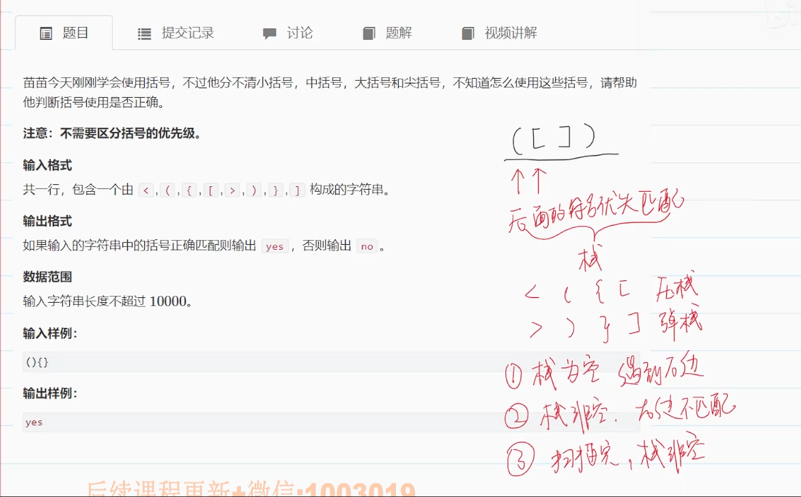​

```c++
#include<iostream>
#include<stack>
using namespace std;
int main(){
    stack<int> myStack;
    char arr[10000];
    scanf("%s",arr);
    for(int i=0;arr[i]!='\0';i++){
        if(arr[i]=='<'||arr[i]=='('||
           arr[i]=='{'||arr[i]=='['){
            myStack.push(arr[i]);
        }else if(arr[i]=='>'){
            if(myStack.empty()||myStack.top()!='<'){
                printf("no\n");
                return 0;
            }else{
                myStack.pop();
            }
        }else if(arr[i]==')'){
            if(myStack.empty()||myStack.top()!='('){
                printf("no\n");
                return 0;
            }else{
                myStack.pop();
            }
        }else if(arr[i]=='}'){
            if(myStack.empty()||myStack.top()!='{'){
                printf("no\n");
                return 0;
            }else{
                myStack.pop();
            }
        }else if(arr[i]==']'){
            if(myStack.empty()||myStack.top()!='['){
                printf("no\n");
                return 0;
            }else{
                myStack.pop();
            }
        }
    }
    if(myStack.empty()){
        printf("yes\n");
    }else{
        printf("no\n");
    }
}


```

# 排序和查找

### 排序基本知识

sort(arr,arr+6);

sort(vec.begin(),vec.end());

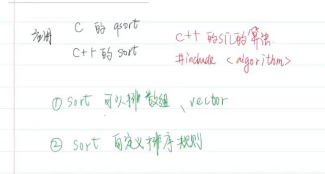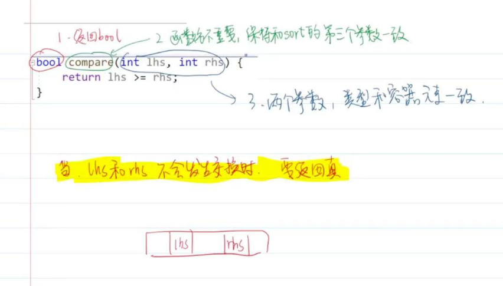​

```c++
#include<iostream>
#include<algorithm>
#include<stack>
using namespace std;
bool compare(int l,int r){
    return l>=r;
}
int main(){
   int arr[6]={2,5,1,6,4,9};
    //[),sort 第一个填起始地址，第二个填最后一个元素的后一个位置的地址
   sort(arr,arr+6);
   vector<int> vec={2,5,1,6,4,9};
   sort(vec.begin(),vec.end());
   sort(vec.begin(),vec.end(), compare);
}
```

### KY66 整数奇偶排序

[https://www.nowcoder.com/share/jump/5838130341742307830649](https://www.nowcoder.com/share/jump/5838130341742307830649)

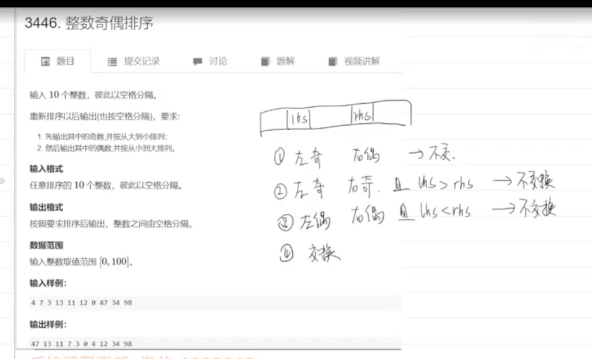

```c++
/*
 *不交换时返回真
 * 1.奇数>偶数
 * 2.同为奇数：大>小
 * 3.同为偶数：小>大
 */
#include <iostream>
#include<algorithm>
using namespace std;
bool compare(int left,int right){
    if(left%2==1 && right%2==0){
        return true;
    }else if(left%2==1 && right%2==1 && left>right ){
        return true;
    }else if(left%2==0 && right%2==0 && left<right ){
        return true;
    }else{
        return false;
    }

}
int main(){
    int arr[10];
    for(int i=0;i<10;i++){
        scanf("%d",&arr[i]);
    }
    sort(arr,arr+10,compare);
    for(int i=0;i<10;i++){
        printf("%d ",arr[i]);
    }
    printf("\n");
}
```

### KY8 成绩排序

[https://www.nowcoder.com/share/jump/5838130341742308002592](https://www.nowcoder.com/share/jump/5838130341742308002592)

```c++
/*
 *不交换时返回真
 * 1.奇数>偶数
 * 2.同为奇数：大>小
 * 3.同为偶数：小>大
 */
#include <iostream>
#include<algorithm>
using namespace std;
struct Student{
    int number;
    int grade;
};
bool compare(Student left,Student right){
    if(left.grade < right.grade){
        return true;
    }else if((left.grade==right.grade)&&(left.number<right.number)){
        return true;
    }else{
        return false;
    }
}
int main(){
    int n;
    scanf("%d",&n);
    Student arr[n];
    for(int i=0;i<n;i++){
        //scanf中间没有空格
        scanf("%d%d",&arr[i].number,&arr[i].grade);
    }
    sort(arr,arr+n, compare);
    for(int i=0;i<n;i++){
        printf("%d %d\n",arr[i].number,arr[i].grade);
    }
}
```

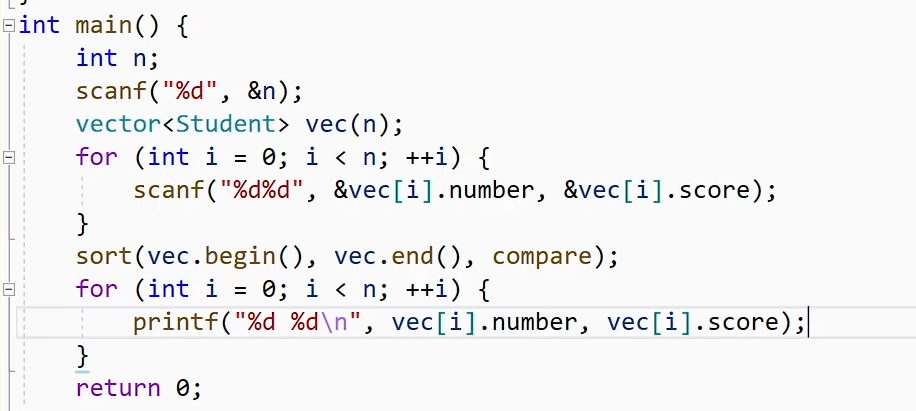​

### KY1 成绩排序

[https://www.nowcoder.com/share/jump/5838130341742352109108](https://www.nowcoder.com/share/jump/5838130341742352109108)

‍

```c++
#include<iostream>
#include<vector>
#include<algorithm>
using namespace std;
struct Student{
    char name[20];
    int grade;
    int seq;
};
bool compare1(Student left,Student right){//降序+稳定
    if(left.grade>right.grade){
        return true;
    }else if((left.grade==right.grade)&& left.seq<right.seq){
        return true;
    }else{
        return false;
    }
}
bool compare2(Student left,Student right){//升序+稳定
    if(left.grade<right.grade){
        return true;
    }else if((left.grade==right.grade)&& left.seq<right.seq){
        return true;
    }else{
        return false;
    }
}
int main(){
    int n;
    int flag;
    while(scanf("%d",&n)!=EOF){
        //注意是()
        vector<Student> vec(n);
        scanf("%d",&flag);
        for(int i=0;i<n;i++){
            scanf("%s%d",&vec[i].name,&vec[i].grade);
            vec[i].seq=i;
        }
        if(flag){
            sort(vec.begin(),vec.end(), compare2);
        }else{
            sort(vec.begin(),vec.end(), compare1);
        }
        for(int i=0;i<n;i++){
            printf("%s %d\n",vec[i].name,vec[i].grade);
        }
    }


}
```

‍

## 查找

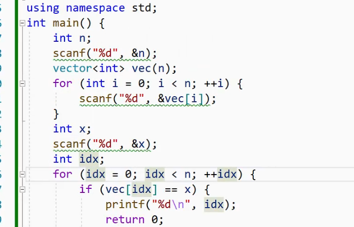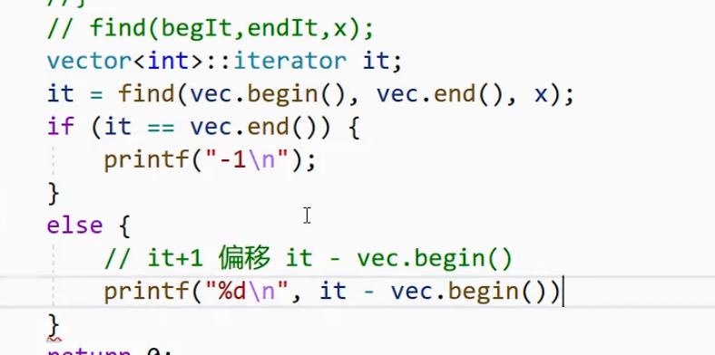​

‍

‍

‍

‍

‍

‍

‍

‍

‍
